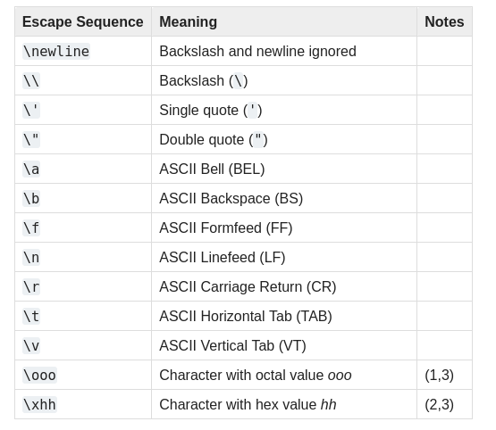

# Python
Python Basics

## Introduction
In this module, you will be learning the basics of Python.


## Learning Objectives
* Create and execute a Python file
* Write and run Python code in Visual Sudio Code
* Python concepts: 
  * Printing to the console
  * Variables
  * input()
  * Operators
  * Namespace
  * Comments/docstring
  * Keywords
  * Indentation


## How to Read This

**>>>** means the code is being run in the Python interpreter. Insert the Python code that  is displayed after the symbols. Do not write those symbols in your script.


<div id="top"></div>

Table of Contents
=================

- [Reassigning Variables](#reassigning-variables)
- [Numeric Values](#numeric-values)
- [Integers & Floats](#integers-&-floats)
- [Dealing With Large Numbers](#dealing-with-large-numbers)
- [Numeric Operators & Order of Operation](#numeric-operators-&-order-of-operation)
- [Strings](#strings)
- [f-strings](#f-strings)
- [Multiple Assignments](#multiple-assignments)
- [Character Escape Sequences](#character-escape-sequences)
- [Avoiding Syntax Errors with Strings](#avoiding-syntax-errors-with-strings)
- [Tips](#tips)
- [Exercises](#exercises)
- [Vocabulary](#vocabulary) 
- [Contributing](#contributing) 
- [License](#license)
- [Contact](#contact)


Reassigning Variables
=====================

You can reassign a value inside of the variable by declaring after it has been instantiated.

``` Python
>>> favorite_animal = "cat"
>>> favorite_animal
cat
>>> favorite_animal = "dog"
>>> favorite_animal
dog
```


Numeric Values
==============

In Python, whole numbers and ones with fractional parts are handled differently. They are integers and floats, respectively. Integers are whole numbers without any decimals. Floats are numbers with decimal points.

When dealing with numbers, the interpreter can act as a [calculator](https://docs.python.org/3/tutorial/introduction.html#using-python-as-a-calculator), where the operators **+, -, *, and /** follow the expression syntax as most languages.

With division operations, the result will default in a float data type. If you mix the data types, an integer with a float, you will end up with a float.

``` Python
>>> 2 * 2
4
>>> 10 / 5
2.0
>>> 4.0 * 2
8.0
```

``` Python
>>> 10 / 5
2.0
>>> 4.0 * 2
8.0
```


Dealing with large numbers
==========================

If you happen to work with large numbers, you might be accustomed to working with commas. However, if you put a comma in your numeric values, you will produce an error. In order to increase readability of your code, you can use an underscore.

``` Python
>>> print(1_600_000_000_00)
160000000000
>>> print(16_0.00_000_000_0)
160.0
```

Numeric Operators & Order of Operation
======================================

There are four basic modes of operations: 
* Add (+)
* Subtract (-)
* Multiply (*)
* Divide (/)

``` Python
>>> 2 + 2
4
>>> 3 / 6
0.5
```
By default, there is an order of operations, which allows you to use parentheses to modify the order of operations. 

``` Python
>>> 2 + 3 * 3
11
>>> (2 + 3) * 3
15
```

To see the data type of an object:
  ```python
  >>> num = 3
  >>> type(num)
  <class 'int'>
```
``` Python
  >>> num = "3"
  >>> type(num)
  <class 'str'>
  ``` 


Strings 
=================
Strings in Python are the sequence of characters stored in contiguous memory location i.e. array of characters. These set of characters are represented in either single quotes or double quotes.

``` Python
>>> str = "Hello"
>>> str
Hello


>>> str = "Hello"
>>> str + " User"
Hello User
```
**Zero-based Indexing**
Square brackets allows access to a single letter when a number is included, serving as the index.
‘+’ is used to concatenate the string in Python.
``` python
>>> str = "Hello"
>>> str[1]
e
```


f-strings
==========

[f-string](https://docs.python.org/3/tutorial/inputoutput.html#tut-f-strings): f is for format, Python formats the string by substituting the name within the curly braces with its value.


``` Python
type = "color"
specific = "red"
print(f"My favorite {type} is {specific}.)
```


Multiple Assignments
=================

It is possible to assign multiple values to different variables on a single line. You might find it beneficial for reading your program. Each respective variable assignment is seperated by a comma to the right of the equal sign. 

``` Python
z, y, x = 3, 2, 1
```


Character Escape Sequences
=================

```python
print("Python")
Python
print("\tPython")
    Python
```

Here is a list of escape sequeces:



Avoiding Syntax Errors with Strings
=================

SyntaxError: invalid syntax
``` python
You’ll see the following output:
File "apostrophe.py", line 1
message = 'Today's date is October 12th.'
^
SyntaxError: invalid syntax
```
Error occurs right after the second single quote with an uptick pointing up torads where the error occurred/code stopped running.


Tips
=================

* Run code with print() to test code
* Use help("keywords") to get a list of available keywords


Exercise
=================

You can create a Python script or continue working in the terminal or IDLE. The provided solutions will be in an IDE (Integrated development environment). Each solution is commented by [string literals](https://docs.python.org/3/reference/lexical_analysis.html#string-and-bytes-literals), simply delete the first 3 double quotation marks.

    Ex.1: my_string = "         Hello World   "

1. Print out addition, subtraction, division, and multiplication that results in the integer number 10.
2. Print out addition, subtraction, division, and multiplication that results in the float number 8.0
3. Save a new script called name_strings.py. Print out your first and last name in a sentence, using 2 different variables. 
4. Get an input from a user for their first name. Print out a greeting to a person by their first name using an f string.
5. Convert a variable to all lowercase and uppercase.
6. Print out a your favorite animal, color, and sport in a comprehensive sentence. 
7. Get an input with extra white space and use the listed methods to eliminate the spaces.
8. Remove the blank spaces in the string on Ex.1
9. Replace the second word with Sunshine in Ex.1 with the spaces removed.


Vocabulary
=================

title()
upper()
lower()
strip() (or specify with rstrip() or lstrip())
upper()
lower()
startswith()
endswith()
find()
replace()


